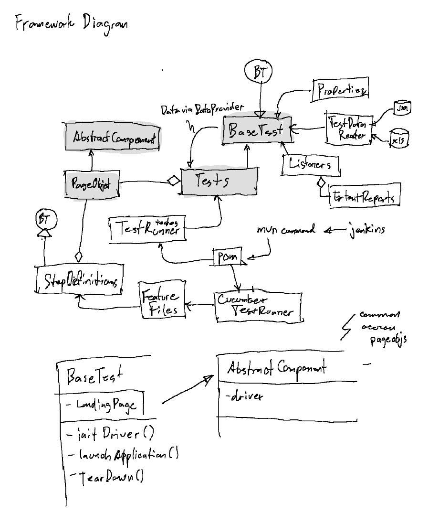

# roche-taf-demo
Jay's project repo for a Test Automation framework for Roche

proj: https://github.com/jayslabs/roche-taf-demo | jdk 21, mvn

TO RUN: 
1. go to project root folder
2. mvn clean test -Dtest=StandAloneTest
3. Test Results are generated in <project root>/test-output/index.html

dependencies: selenium-java, testng, cucumber-java, cucumber-testng, webdrivermanager, poi, mysql, jackson, extentreports

Activity Log:
- created Utility.java to read properties from GlobalData.properties; replaced several hardcoded values with calls to Utility.getProperty()
- Initial sample Test: StandAloneTest.java - Open browser and navigate to roche diagnostics home page
- setup template for dependencies, 
    packages (src/main/java:pageObjects, util; src/test/java:test, test.components); common files: pageObjects[AbstractComponent, LandingPage], util[ExtentReportNG], test.components[BaseTest, Listeners, Retrier], test.data[ExcelDataUtil, JDBCUtil, JsonDataReader], GlobalData.properties
- initial project setup

## Framework Diagram

